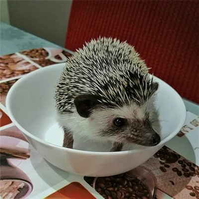
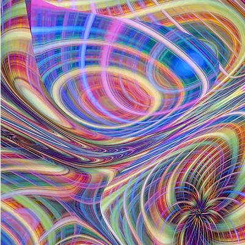
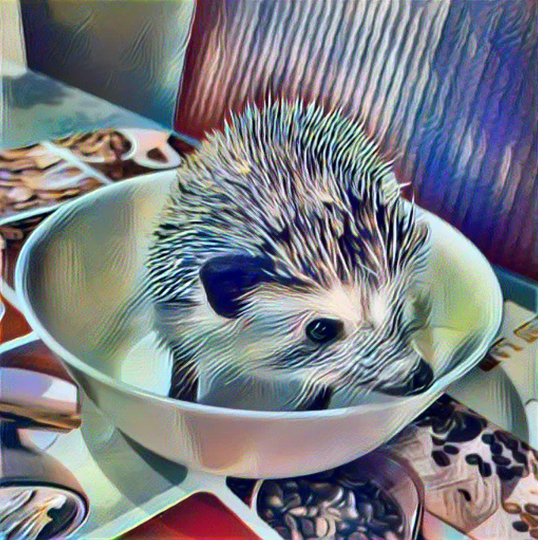

# Neural Style Transfer with PyTorch and Streamlit

This project implements a Neural Style Transfer model using PyTorch to combine content and style images, enabling users to generate new images that retain the content of one image while adopting the artistic style of another. The model utilizes the VGG network for feature extraction and optimizes the target image through gradient descent. A Streamlit-based interface provides an easy way to upload images, adjust settings, and view results in real-time.


## Features

- **Content and Style Image Uploads:** Easily upload images to specify the content and style sources.
- **Real-Time Processing:** Streamlit interface for live preview of transformations.
- **Adjustable Style and Content Weights:** Fine-tune the blend between content and style features.
- **Image Exporting:** Save the generated image locally.

## Project Structure

```bash
.
├── app.py                   # Streamlit app entry point
├── model.py                 # Model and neural style transfer implementation
├── requirements.txt         # Python dependencies
├── README.md                # Project documentation
└── assets                   # Folder for content and style images
```

## Requirements

- **Python 3.7+**
- **PyTorch**
- **Streamlit**
- **Pillow** (for image processing)

Install all dependencies using:

```bash
pip install -r requirements.txt
```

## Usage

1. **Clone the Repository**

   ```bash
   git clone https://github.com/srivastava491/Neural-Style-Transfer.git
   cd Neural-Style-Transfer
   ```

2. **Run the Streamlit Application**

   ```bash
   streamlit run app.py
   ```

3. **Upload Images and Generate Style Transfer**

   - Upload a **content image** (the image to preserve in structure).
   - Upload a **style image** (the style you want to apply).
   - Adjust the **content** and **style weights** to control the balance.

4. **Save the Resulting Image**

   - Click **Download** to save the transformed image locally.

## Implementation Details

### Neural Style Transfer

This project is based on the paper *A Neural Algorithm of Artistic Style* by Gatys et al. The model calculates **content loss** and **style loss**:

- **Content Loss**: Measures how much the target image retains the structure of the content image.
- **Style Loss**: Measures how much the target image captures the style of the style image using Gram matrix representations.

### VGG Network

The **VGG network** is used for feature extraction due to its strong performance in capturing image structures and textures. Layers are carefully selected to optimize both content and style representations.

## Example Results

| Content Image   | Style Image  | Generated Image |
|-----------------|--------------|-----------------|
|  |  |  |

## Future Improvements

- **GPU Support**: Enhance processing speed with GPU compatibility.
- **Preset Styles**: Provide a collection of popular style images.
- **Refinement Controls**: More options for fine-tuning style and content influence.

## References

- Gatys, L. A., Ecker, A. S., & Bethge, M. (2015). *A Neural Algorithm of Artistic Style*. [Link to paper](https://arxiv.org/abs/1508.06576)
